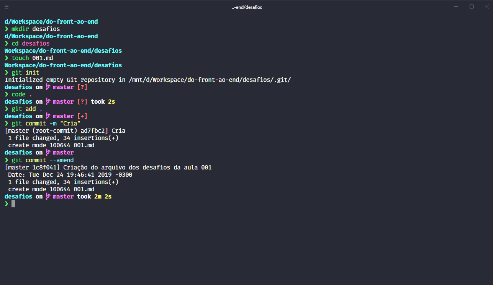

# :mortar_board: Desafios aula 001

1. [Fácil](#1-fácil)
2. [Médio](#2-médio)
3. [Difícil](#3-difícil)

### 1. Fácil

O primeiro desafio consiste em alterar o tema padrão do **zsh**.  

Segue abaixo um print do terminal com um tema diferente.  



Foram utilizados os temas:  

> __[Dracula](https://draculatheme.com/hyper/):__ na alteração do tema do _hyper_.  
> __[Spaceship](https://github.com/denysdovhan/spaceship-prompt):__ na alteração do tema do _zsh_.
  
---
  
### 2. Médio

O segundo desafio consiste em criar algumas marcações em um documento *markdown* diferentes das que foram apresentadas em aula.  

Esse próprio documento é o resultado do segundo desafio, com as seguintes novas marcações.

Marcação | Resultado
--- | ---
`##` | Título secundário
`###` | Título terciário
`_texto_` / `*texto*` | Itálico
`__texto__` / `**texto**` | Negrito
`[texto](link)` | Link
`` | Imagem
`---` | Separador
`>` | Citação em bloco
&nbsp; | Essa tabela _(não faz parte da especificação do MD, pertencendo ao GFM)_
   
--- 

### 3. Difícil

O terceiro desafio consiste em alterar o último _commit_ realizado no __git__.

Para alterar o último _commit_, basta utilizar o comando abaixo e alterar a mensagem do commit.

```
git commit --amend -m "Nova mensagem"
```
